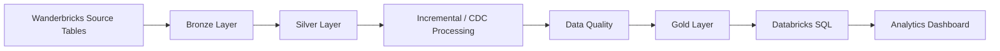

# Databricks Lakehouse ETL Pipeline- End-to-End Analytics Engineering Project

## Overview

This project demonstrates an end-to-end **data engineering pipeline built with Databricks** using the Wanderbricks travel booking dataset. The pipeline implements a **Medallion Architecture** with Bronze, Silver, and Gold layers and uses **PySpark, Delta Lake, SQL, and Databricks Workflows** for data ingestion, transformation, incremental processing, data quality validation, orchestration, and analytics.

The project focuses on the Wanderbricks **bookings** data and demonstrates how raw booking data can be transformed into analytics-ready datasets and presented through an interactive Databricks SQL dashboard.

## Objectives

- Build an end-to-end Lakehouse ETL pipeline using Databricks
- Implement Bronze, Silver, and Gold data layers
- Use PySpark for data transformation
- Store processed data using Delta Lake
- Implement incremental/CDC processing using booking updates
- Perform data quality validation
- Create analytics-ready Gold tables
- Orchestrate the pipeline using Databricks Workflows
- Develop SQL-based analytics and an interactive dashboard

## Architecture



### Medallion Architecture

```text
Wanderbricks
     |
     v
+-----------------------+
| Bronze Layer          |
| Raw source data       |
+-----------+-----------+
            |
            v
+-----------------------+
| Silver Layer          |
| Cleaned and prepared  |
| booking data          |
+-----------+-----------+
            |
            v
+-----------------------+
| Incremental / CDC     |
| booking_updates       |
+-----------+-----------+
            |
            v
+-----------------------+
| Data Quality          |
| Validation checks     |
+-----------+-----------+
            |
            v
+-----------------------+
| Gold Layer            |
| Analytics-ready data  |
+-----------+-----------+
            |
            v
+-----------------------+
| Databricks SQL        |
| Analytics Dashboard   |
+-----------------------+
```

## Technologies

- **Databricks**
- **PySpark**
- **Python**
- **SQL**
- **Delta Lake**
- **Databricks Workflows**
- **Databricks SQL**
- **Git / GitHub**

## Dataset

The project uses the **Wanderbricks** sample dataset available within Databricks.

The source dataset contains travel-booking related tables including:

- `bookings`
- `booking_updates`
- `users`
- `properties`
- `payments`
- `reviews`

This implementation focuses on the **bookings pipeline**, with `booking_updates` used to demonstrate incremental processing and CDC-style updates.

## Data Pipeline

### 1. Bronze Layer – Data Ingestion

The source Wanderbricks data is ingested into Delta tables in the Bronze schema.

For example:

```text
samples.wanderbricks.bookings
            |
            v
wanderbricks.bronze.bookings
```

The Bronze layer provides the raw landing layer for downstream transformations.

### 2. Silver Layer – Data Transformation

The Bronze booking data is transformed using PySpark to create a clean Silver dataset.

The transformation includes:

- Selecting relevant booking attributes
- Removing unnecessary fields
- Removing duplicate records
- Handling data types
- Preparing timestamp fields
- Preparing the data for incremental processing and analytics

The resulting table is:

```text
wanderbricks.silver.bookings
```

The Silver booking table contains:

```text
booking_id
user_id
property_id
guests_count
total_amount
status
created_at
updated_at
```

### 3. Incremental Processing / CDC

The `booking_updates` dataset is used to simulate changes to booking records.

The pipeline identifies the **latest update for each booking** using `updated_at` and `booking_update_id`, and applies those changes using Delta Lake `MERGE`.

The process follows:

```text
booking_updates
       |
       v
Latest update per booking
       |
       v
Delta MERGE
   /        \
Update      Insert
existing    new
records     records
       \      /
        v    v
   Silver bookings
```

This approach demonstrates incremental processing rather than relying exclusively on full-table refreshes.

### 4. Data Quality

Data quality checks are performed on the transformed booking data.

The implemented checks include:

- Total record count
- Distinct record count
- Duplicate detection
- NULL-value inspection
- Numerical value inspection
- Bronze-to-Silver record comparison

The resulting Silver booking dataset contains:

```text
Total records:     72,247
Distinct records:  72,247
Duplicate records: 0
```

### 5. Gold Layer – Analytics

The validated Silver booking data is transformed into analytics-ready Gold tables.

#### `fact_bookings`

A booking-level fact table containing:

- Booking ID
- User ID
- Property ID
- Guest count
- Total booking amount
- Booking status
- Booking timestamp
- Booking date
- Booking year
- Booking month
- Booking day of week

#### `booking_daily_summary`

A daily aggregation containing:

- Total bookings
- Total revenue
- Average booking value
- Total guests

These Gold tables provide the analytical foundation for the Databricks SQL dashboard.

## Workflow Orchestration

The pipeline is orchestrated using **Databricks Workflows**.


The workflow contains sequential tasks:

```text
bronze_ingestion
       |
       v
silver_transformation
       |
       v
incremental_bookings
       |
       v
data_quality_and_gold_analytics
```

Each stage depends on the successful completion of the preceding stage.

The completed workflow was successfully executed using Databricks Serverless compute.

### Workflow Preview


Fig. Workflow orchestration

## Dashboard

The Gold tables are queried using **Databricks SQL** to create an interactive **Bookings Analytics Dashboard**.

The dashboard provides a comprehensive overview of booking performance and trends.


Fig. Dashboard

### Key Performance Indicators

The dashboard includes four main KPIs:

- **Total Bookings:** 72.27K
- **Total Revenue:** 40.19M
- **Average Booking Value:** 555.57
- **Total Guests:** 133.51K

### Visualizations

The dashboard includes:

#### Daily Bookings

A time-series visualization showing the change in booking volume over time.

#### Daily Revenue

A time-series visualization showing daily revenue trends.

#### Bookings by Status

A comparison of booking volume across different booking statuses, including:

- Cancelled
- Completed
- Confirmed
- Pending

#### Booking Revenue by Month

A monthly comparison of total booking revenue, showing the distribution of revenue across the calendar year.

### Interactive Filtering

The dashboard includes a **Booking Status** filter, allowing users to interactively analyze booking metrics by status.

## SQL Analytics

The `sql/` directory contains the SQL queries used to generate the dashboard metrics and analytical views.

The queries support analysis of:

- Overall booking volume
- Revenue performance
- Average booking value
- Guest volume
- Daily booking trends
- Daily revenue trends
- Booking status distribution
- Monthly booking revenue

## Project Structure

```text
databricks-lakehouse-project/
│
├── README.md
│
├── notebooks/
│   ├── 01_bronze_ingestion_wanderbricks.py
│   ├── 02_silver_transformation_wanderbricks.py
│   ├── 03_incremental_bookings_wanderbricks.py
│   └── 04_data_quality_&_gold_transformation_wanderbricks.py
│
├── sql/
    ├── dashboard_queries_1.sql
    └── dashboard_queries_2.sql

```

## Key Data Engineering Concepts Demonstrated

### Lakehouse Architecture

Implemented a Bronze → Silver → Gold architecture to separate raw, transformed, validated, and analytics-ready data.

### PySpark

Used PySpark DataFrame operations for data ingestion, transformation, data quality checks, aggregation, and incremental processing.

### Delta Lake

Used Delta tables as the storage layer and Delta Lake `MERGE` operations for incremental booking updates.

### CDC / Incremental Processing

Implemented latest-record selection using window functions and timestamps to identify the most recent booking update before applying changes to the Silver dataset.

### Data Quality

Implemented validation checks covering record counts, duplicates, NULL values, numerical values, and source-to-target comparisons.

### Data Modeling

Created a booking-level fact table and an aggregated daily summary table to provide an analytical layer for downstream SQL queries.

### Workflow Orchestration

Created a dependency-based Databricks Workflow to execute the pipeline stages in sequence.

### SQL Analytics

Developed SQL queries against the Gold layer to support KPI calculations, trend analysis, status analysis, and dashboard visualizations.

## Key Results

The completed pipeline demonstrates:

- **72,247** booking records processed
- **0** exact duplicate records after Silver transformation
- Bronze → Silver → Gold Lakehouse architecture
- Delta Lake-based incremental processing
- Automated Databricks Workflow orchestration
- Analytics-ready Gold tables
- Interactive Databricks SQL dashboard

## Future Improvements

Potential extensions include:

- Extending the Silver pipeline to `users`, `properties`, `payments`, and `reviews`
- Building a broader dimensional model combining bookings with users, properties, payments, and reviews
- Implementing automated pipeline failure handling
- Adding data-quality alerts
- Adding unit tests for PySpark transformations
- Adding pipeline monitoring and observability
- Parameterizing the ingestion process for multiple source tables
- Integrating the pipeline with Apache Airflow for external orchestration

## Author

**Ye Htut**

GitHub: https://github.com/yehtut1995
